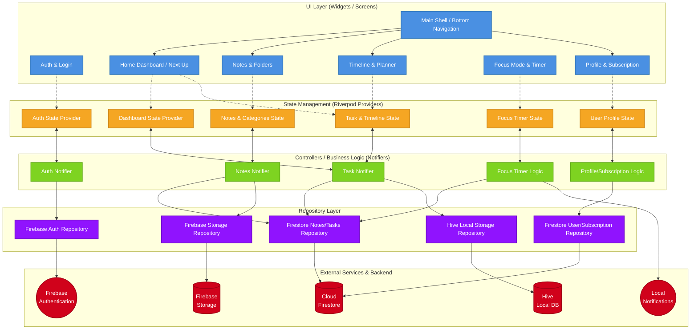

# Synq Architecture Overview

Below is a detailed Mermaid diagram illustrating the architecture of the Synq app, based on its Feature-First structure, Riverpod state management, and Firebase data layer.

