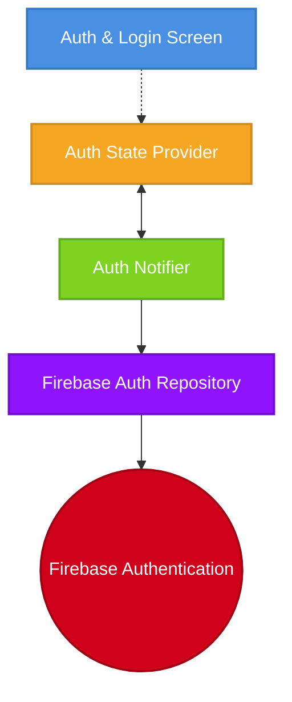

# Authentication & Login Architecture

Handles secure email/password and Google Sign-In, and user session management.

```mermaid
graph TD
    classDef ui fill:#4A90E2,stroke:#357ABD,stroke-width:2px,color:#fff;
    classDef state fill:#F5A623,stroke:#D08C1F,stroke-width:2px,color:#fff;
    classDef controller fill:#7ED321,stroke:#64AD1A,stroke-width:2px,color:#fff;
    classDef repo fill:#9013FE,stroke:#720ECA,stroke-width:2px,color:#fff;
    classDef ext fill:#D0021B,stroke:#A10115,stroke-width:2px,color:#fff;

    AuthScreen[Auth & Login Screen]:::ui
    AuthProvider[Auth State Provider]:::state
    AuthNotifier[Auth Notifier]:::controller
    AuthRepo[Firebase Auth Repository]:::repo
    FirebaseAuth((Firebase Authentication)):::ext

    AuthScreen -.-> AuthProvider
    AuthProvider <--> AuthNotifier
    AuthNotifier --> AuthRepo
    AuthRepo --> FirebaseAuth
```
