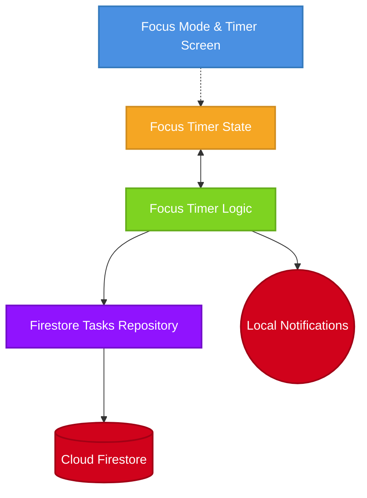

# Focus Mode Architecture

Dedicated distraction-free interface, timer logic (scheduled/elapsed), and notifications.

```mermaid
graph TD
    classDef ui fill:#4A90E2,stroke:#357ABD,stroke-width:2px,color:#fff;
    classDef state fill:#F5A623,stroke:#D08C1F,stroke-width:2px,color:#fff;
    classDef controller fill:#7ED321,stroke:#64AD1A,stroke-width:2px,color:#fff;
    classDef repo fill:#9013FE,stroke:#720ECA,stroke-width:2px,color:#fff;
    classDef ext fill:#D0021B,stroke:#A10115,stroke-width:2px,color:#fff;

    FocusScreen[Focus Mode & Timer Screen]:::ui
    FocusProvider[Focus Timer State]:::state
    FocusNotifier[Focus Timer Logic]:::controller
    FirestoreNotesRepo[Firestore Tasks Repository]:::repo
    Notifications((Local Notifications)):::ext
    FirestoreDB[(Cloud Firestore)]:::ext

    FocusScreen -.-> FocusProvider
    FocusProvider <--> FocusNotifier
    FocusNotifier --> FirestoreNotesRepo
    FocusNotifier --> Notifications
    FirestoreNotesRepo --> FirestoreDB
```
