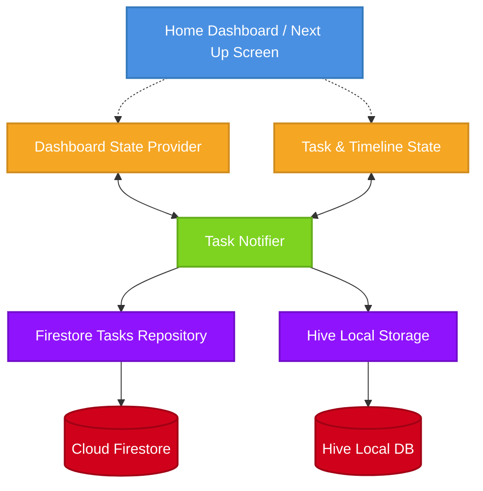

# Home Dashboard (Next Up) Architecture

Displays upcoming tasks, today's summary, and provides quick actions for users.

```mermaid
graph TD
    classDef ui fill:#4A90E2,stroke:#357ABD,stroke-width:2px,color:#fff;
    classDef state fill:#F5A623,stroke:#D08C1F,stroke-width:2px,color:#fff;
    classDef controller fill:#7ED321,stroke:#64AD1A,stroke-width:2px,color:#fff;
    classDef repo fill:#9013FE,stroke:#720ECA,stroke-width:2px,color:#fff;
    classDef ext fill:#D0021B,stroke:#A10115,stroke-width:2px,color:#fff;

    HomeScreen[Home Dashboard / Next Up Screen]:::ui
    HomeProvider[Dashboard State Provider]:::state
    TaskProvider[Task & Timeline State]:::state
    TaskNotifier[Task Notifier]:::controller
    FirestoreNotesRepo[Firestore Tasks Repository]:::repo
    LocalRepo[Hive Local Storage]:::repo
    FirestoreDB[(Cloud Firestore)]:::ext
    HiveDB[(Hive Local DB)]:::ext

    HomeScreen -.-> HomeProvider
    HomeScreen -.-> TaskProvider
    HomeProvider <--> TaskNotifier
    TaskProvider <--> TaskNotifier
    TaskNotifier --> FirestoreNotesRepo
    TaskNotifier --> LocalRepo
    FirestoreNotesRepo --> FirestoreDB
    LocalRepo --> HiveDB
```
