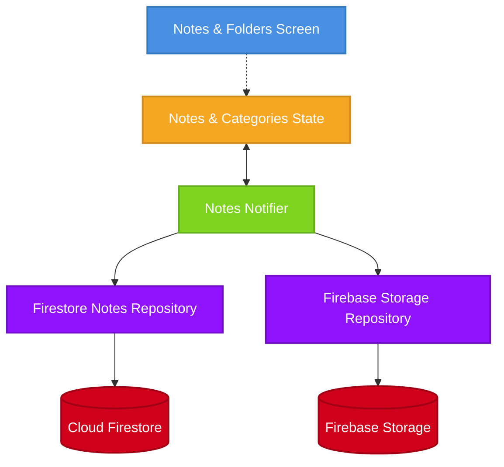

# Notes & Folders Architecture

Handles rich text note-taking, markdown editing, and folder organization.

```mermaid
graph TD
    classDef ui fill:#4A90E2,stroke:#357ABD,stroke-width:2px,color:#fff;
    classDef state fill:#F5A623,stroke:#D08C1F,stroke-width:2px,color:#fff;
    classDef controller fill:#7ED321,stroke:#64AD1A,stroke-width:2px,color:#fff;
    classDef repo fill:#9013FE,stroke:#720ECA,stroke-width:2px,color:#fff;
    classDef ext fill:#D0021B,stroke:#A10115,stroke-width:2px,color:#fff;

    NotesScreen[Notes & Folders Screen]:::ui
    NoteProvider[Notes & Categories State]:::state
    NotesNotifier[Notes Notifier]:::controller
    FirestoreNotesRepo[Firestore Notes Repository]:::repo
    StorageRepo[Firebase Storage Repository]:::repo
    FirestoreDB[(Cloud Firestore)]:::ext
    FirebaseStorage[(Firebase Storage)]:::ext

    NotesScreen -.-> NoteProvider
    NoteProvider <--> NotesNotifier
    NotesNotifier --> FirestoreNotesRepo
    NotesNotifier --> StorageRepo
    FirestoreNotesRepo --> FirestoreDB
    StorageRepo --> FirebaseStorage
```
