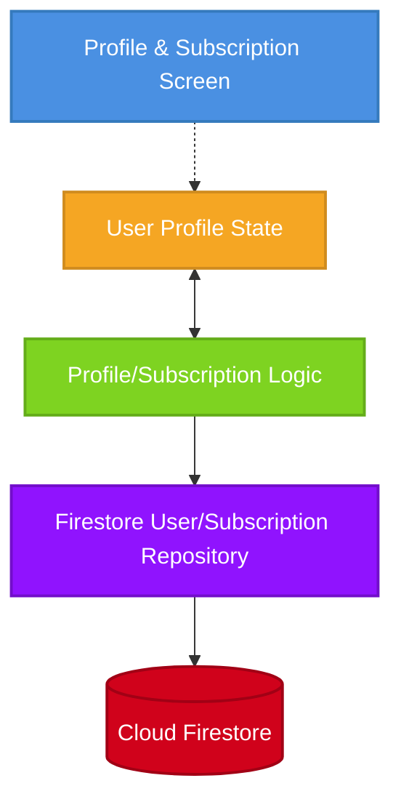

# Profile & Subscription Architecture

Managing user account settings, productivity stats, and Pro plan (Free vs Pro).

```mermaid
graph TD
    classDef ui fill:#4A90E2,stroke:#357ABD,stroke-width:2px,color:#fff;
    classDef state fill:#F5A623,stroke:#D08C1F,stroke-width:2px,color:#fff;
    classDef controller fill:#7ED321,stroke:#64AD1A,stroke-width:2px,color:#fff;
    classDef repo fill:#9013FE,stroke:#720ECA,stroke-width:2px,color:#fff;
    classDef ext fill:#D0021B,stroke:#A10115,stroke-width:2px,color:#fff;

    ProfileScreen[Profile & Subscription Screen]:::ui
    ProfileProvider[User Profile State]:::state
    ProfileNotifier[Profile/Subscription Logic]:::controller
    FirestoreUserRepo[Firestore User/Subscription Repository]:::repo
    FirestoreDB[(Cloud Firestore)]:::ext

    ProfileScreen -.-> ProfileProvider
    ProfileProvider <--> ProfileNotifier
    ProfileNotifier --> FirestoreUserRepo
    FirestoreUserRepo --> FirestoreDB
```
