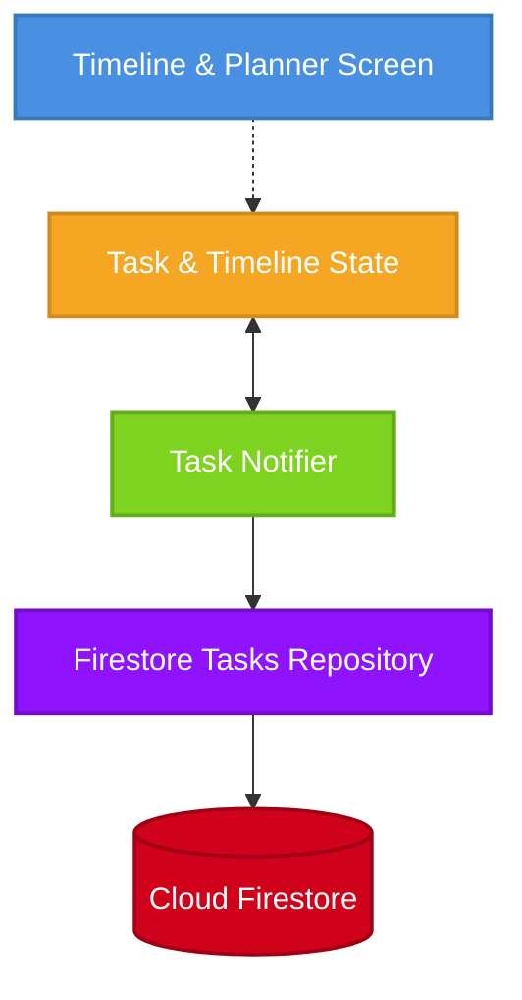

# Timeline & Planner Architecture

A visual representation of tasks for the day, including due dates, reminders, and recurring tasks.

```mermaid
graph TD
    classDef ui fill:#4A90E2,stroke:#357ABD,stroke-width:2px,color:#fff;
    classDef state fill:#F5A623,stroke:#D08C1F,stroke-width:2px,color:#fff;
    classDef controller fill:#7ED321,stroke:#64AD1A,stroke-width:2px,color:#fff;
    classDef repo fill:#9013FE,stroke:#720ECA,stroke-width:2px,color:#fff;
    classDef ext fill:#D0021B,stroke:#A10115,stroke-width:2px,color:#fff;

    TimelineScreen[Timeline & Planner Screen]:::ui
    TaskProvider[Task & Timeline State]:::state
    TaskNotifier[Task Notifier]:::controller
    FirestoreNotesRepo[Firestore Tasks Repository]:::repo
    FirestoreDB[(Cloud Firestore)]:::ext

    TimelineScreen -.-> TaskProvider
    TaskProvider <--> TaskNotifier
    TaskNotifier --> FirestoreNotesRepo
    FirestoreNotesRepo --> FirestoreDB
```
