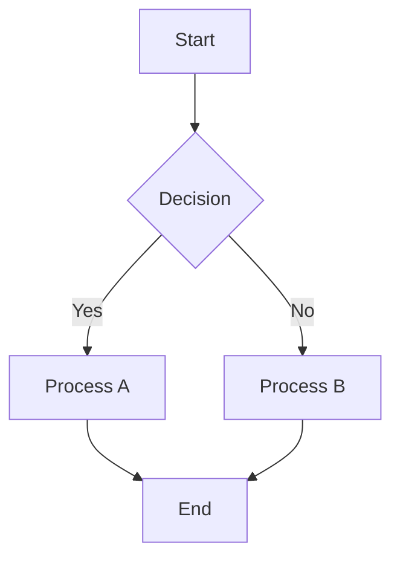

# Complex Markdown Editor Test

> This document is designed to stress-test Markdown editors.

---

## Table of Contents

1. [Headings](#headings)
2. [Lists](#lists)
3. [Tables](#tables)
4. [Code Blocks](#code-blocks)
5. [Blockquotes](#blockquotes)
6. [Images](#images)
7. [Links](#links)
8. [Math](#math)
9. [Task Lists](#task-lists)
10. [Footnotes](#footnotes)
11. [HTML](#html)
12. [Mermaid](#mermaid)
13. [Nested Content](#nested-content)

---

# Headings

# H1
## H2
### H3
#### H4
##### H5
###### H6

---

# Text Formatting

**Bold Text**

*Italic Text*

***Bold + Italic***

~~Strikethrough~~

`Inline Code`

==Highlighted Text==

<u>Underline HTML</u>

Subscript: H~2~O

Superscript: X^2^

---

# Lists

## Unordered

- Item 1
  - Nested 1
    - Nested 2
      - Nested 3
- Item 2
- Item 3

## Ordered

1. First
2. Second
   1. Nested First
   2. Nested Second
3. Third

## Mixed

1. Fruits
   - Apple
   - Banana
     1. Yellow
     2. Green
2. Vegetables
   - Carrot
   - Potato

---

# Task Lists

- [x] Completed Task
- [ ] Pending Task
  - [x] Nested Complete
  - [ ] Nested Pending
    - [ ] Deep Nested

---

# Tables

| ID | Name | Age | Occupation |
|----|------|-----|------------|
| 1 | Alice | 24 | Engineer |
| 2 | Bob | 30 | Designer |
| 3 | Charlie | 28 | Manager |

## Alignment Test

| Left | Center | Right |
| :--- | :----: | ----: |
| A | B | C |
| 1 | 2 | 3 |

---

# Code Blocks

## JavaScript

```javascript
function fibonacci(n) {
  if (n <= 1) return n;
  return fibonacci(n - 1) + fibonacci(n - 2);
}

console.log(fibonacci(10));
```

## Python

```python
class Employee:
    def __init__(self, name):
        self.name = name

    def greet(self):
        return f"Hello {self.name}"

emp = Employee("Ankit")
print(emp.greet())
```

## SQL

```sql
SELECT *
FROM users
WHERE age > 18
ORDER BY created_at DESC;
```

## JSON

```json
{
  "user": {
    "name": "Ankit",
    "age": 23,
    "skills": ["Python", "Flutter", "SQL"]
  }
}
```

---

# Blockquotes

> Single quote

>> Nested quote

>>> Triple nested quote

> ### Markdown inside blockquote
>
> - List item
> - Another item
>
> ```python
> print("Hello")
> ```

---

# Links

Inline Link:

[OpenAI](https://openai.com)

Reference Link:

[Google][google]

[google]: https://google.com

Auto Link:

<https://github.com>

---

# Images


---

# Horizontal Rules

---

***

___

---

# Footnotes

This is a footnote reference.[^1]

Another reference.[^longnote]

[^1]: Small footnote.

[^longnote]:
    Multi-line footnote.

    With another paragraph.

---

# Math

Inline:

$E = mc^2$

Block:

$$
\int_{0}^{\infty}
e^{-x}dx = 1
$$

Matrix:

$$
\begin{bmatrix}
1 & 2 & 3 \\
4 & 5 & 6 \\
7 & 8 & 9
\end{bmatrix}
$$

---

# Mermaid



---

# HTML

<div style="border:1px solid #ccc;padding:10px;">
  <h3>Embedded HTML Block</h3>
  <p>This section tests raw HTML rendering.</p>

  <details>
    <summary>Expandable Content</summary>

    Hidden text inside details tag.

  </details>
</div>

---

# Nested Content

- Level 1
  > Quote Level 1
  >
  > ```javascript
  > console.log("Nested");
  > ```
  >
  > - Nested List
  >   - Nested Again

---

# Emoji Test

😀 😎 🚀 🎉 ❤️ 🔥

---

# Special Characters

\* Escaped Asterisk

\# Escaped Hash

\` Escaped Backtick

\_ Escaped Underscore

---

# Long Paragraph Stress Test

Lorem ipsum dolor sit amet, consectetur adipiscing elit. Sed vitae malesuada lorem. Cras feugiat tincidunt erat, non posuere elit bibendum vel. Donec suscipit, nisl at interdum pellentesque, lectus mauris volutpat odio, non posuere nulla mauris sed neque. Vestibulum ante ipsum primis in faucibus orci luctus et ultrices posuere cubilia curae; Integer non turpis nec risus dignissim faucibus. Suspendisse potenti.

Lorem ipsum dolor sit amet, consectetur adipiscing elit. Pellentesque habitant morbi tristique senectus et netus et malesuada fames ac turpis egestas.

---

# Large Table Stress Test

| Col1 | Col2 | Col3 | Col4 | Col5 | Col6 | Col7 | Col8 |
|------|------|------|------|------|------|------|------|
| 1 | 2 | 3 | 4 | 5 | 6 | 7 | 8 |
| 9 | 10 | 11 | 12 | 13 | 14 | 15 | 16 |
| 17 | 18 | 19 | 20 | 21 | 22 | 23 | 24 |
| 25 | 26 | 27 | 28 | 29 | 30 | 31 | 32 |

---

# End of File

✅ Markdown Stress Test Complete
